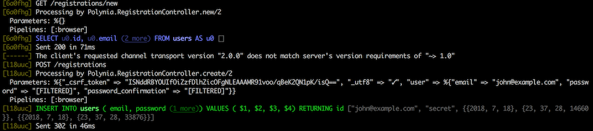

# pretty_print_formatter



Elixir library for coloring the output of the logger. Right now it colorizes Ecto SQL statements and Phoenix's request id metadata.

The idea is to use colors as a way to help developers to spot easier in the console what's happening quickly.

## Documentation

Documentation can be found at [https://hexdocs.pm/pretty_print_formatter](https://hexdocs.pm/pretty_print_formatter).

## Installation

If [available in Hex](https://hex.pm/docs/publish), the package can be installed
by adding `pretty_print_formatter` to your list of dependencies in `mix.exs`:

```elixir
def deps do
  [
    {:pretty_print_formatter, "~> 0.1.0"}
  ]
end
```

After installing the dependency you need to update the config/dev.exs
configuration file and set the new formatter.


```elixir
config :logger, :console, format: {PrettyPrintFormatter, :write}
```

## License

pretty_print_formatter is licensed under the MIT license.

See [LICENSE](./LICENSE) for the full license text.
